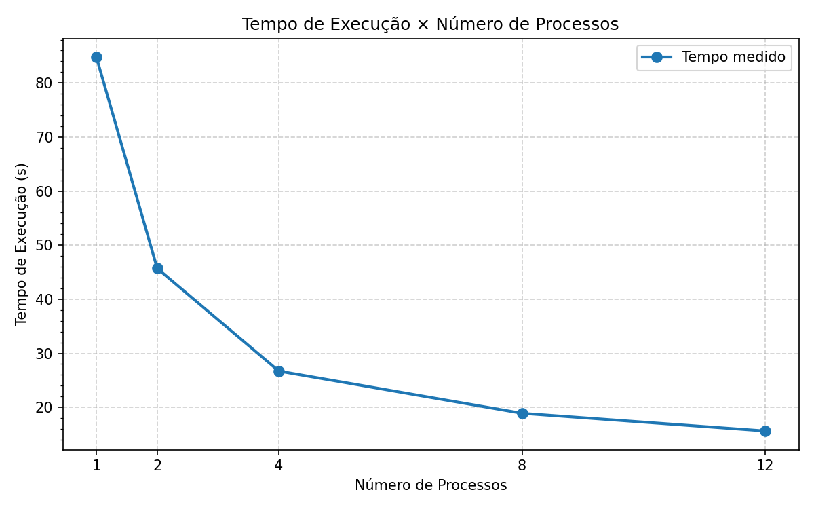
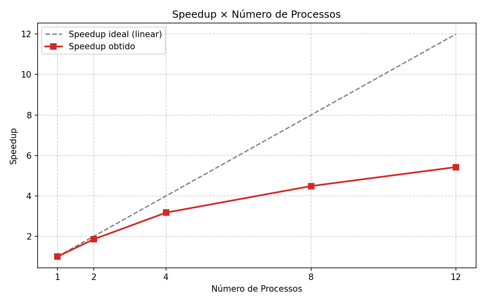
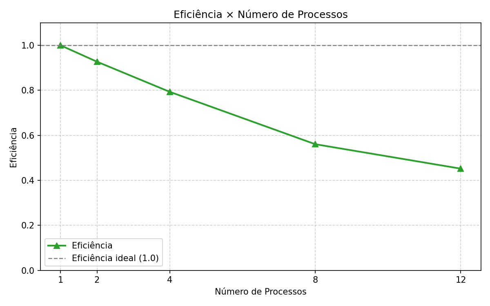

# Relatório de Paralelização — Avaliador de Logs

**Disciplina:** Programação Paralela e Distribuída
**Aluno(s):** Tiago Geraldo de Lima Cosme
**Turma:** Sistemas de Informação
**Professor:** Rafael
**Data:** 25/03/2026

---

# 1. Descrição do Problema

O problema consiste no processamento em lote de grandes volumes de arquivos de log operacionais. Cada arquivo de log contém linhas de texto com palavras-chave (`erro`, `warning`, `info`) que devem ser contabilizadas. Além disso, são coletadas estatísticas gerais de linhas, palavras e caracteres por arquivo, e os resultados são consolidados ao final.

**Questões que devem ser respondidas:**

* **Qual é o objetivo do programa?** Processar 1.000 arquivos de log em paralelo, extraindo contagens de palavras-chave e estatísticas de texto, reduzindo o tempo total de execução em relação à versão serial.
* **Qual o volume de dados processado?** 1.000 arquivos × 10.000 linhas × 20 palavras por linha = 200 milhões de palavras (~1,37 GB de texto).
* **Qual algoritmo foi utilizado?** Paralelização do loop de processamento de arquivos utilizando `multiprocessing.Pool` com `pool.map`. Cada processo worker recebe um subconjunto dos arquivos e executa `processar_arquivo` de forma independente.
* **Qual a complexidade aproximada do algoritmo?** O(N × L) onde N é o número de arquivos e L é o número médio de linhas por arquivo. O processamento de cada arquivo é independente, tornando o problema embaraçosamente paralelo.

---

# 2. Ambiente Experimental

| Item                        | Descrição                         |
| --------------------------- | --------------------------------- |
| Processador                 |12th Gen Intel(R) Core(TM) i7-12700|
| Número de núcleos           | 12 Núcleos(s)                     |
| Memória RAM                 | 16,0 GB                           |
| Sistema Operacional         | Windows 10/11                     |
| Linguagem utilizada         | Python 3.13                       |
| Biblioteca de paralelização | `multiprocessing` (stdlib)        |
| Compilador / Versão         | CPython 3.13                      |

---

# 3. Metodologia de Testes

## Como o tempo foi medido

O tempo de execução foi medido com `time.time()`, registrando o instante imediatamente antes de iniciar o `Pool` e logo após o `pool.map` retornar com todos os resultados.

## Configurações testadas

* 1 processo (equivalente ao serial)
* 2 processos
* 4 processos
* 8 processos
* 12 processos

## Procedimento experimental

* **Número de execuções:** 3 execuções por configuração
* **Métrica:** média aritmética das 3 execuções
* **Entrada:** pasta `log2` com 1.000 arquivos de 10.000 linhas cada
* **Condições:** máquina Windows com carga normal de uso

---

# 4. Resultados Experimentais

Tempos médios de execução obtidos na pasta `log2` (média de 3 execuções):

| Nº Processos | Tempo de Execução (s) |
| ------------ | --------------------- |
| 1            | 84,7636               |
| 2            | 45,7039               |
| 4            | 26,7095               |
| 8            | 18,8997               |
| 12           | 15,6291               |

---

# 5. Cálculo de Speedup e Eficiência

## Fórmulas Utilizadas

### Speedup

```
Speedup(p) = T(1) / T(p)
```

Onde:

* **T(1)** = tempo com 1 processo (84,7636 s)
* **T(p)** = tempo com p processos

### Eficiência

```
Eficiência(p) = Speedup(p) / p
```

Onde:

* **p** = número de processos

---

# 6. Tabela de Resultados

| Processos | Tempo (s) | Speedup | Eficiência |
| --------- | --------- | ------- | ---------- |
| 1         | 84,7636   | 1,0000  | 1,0000     |
| 2         | 45,7039   | 1,8546  | 0,9273     |
| 4         | 26,7095   | 3,1735  | 0,7934     |
| 8         | 18,8997   | 4,4849  | 0,5606     |
| 12        | 15,6291   | 5,4234  | 0,4520     |

---

# 7. Gráfico de Tempo de Execução



---

# 8. Gráfico de Speedup



---

# 9. Gráfico de Eficiência



---

# 10. Análise dos Resultados

**O speedup obtido foi próximo do ideal?**
Não. O speedup obtido ficou bem abaixo do ideal em todas as configurações. Com 2 processos o speedup foi 1,85 (ideal seria 2,0), com 4 processos foi 3,17 (ideal seria 4,0) e com 12 processos foi 5,42 (ideal seria 12,0). Isso indica que há overhead significativo de paralelização.

**A aplicação apresentou escalabilidade?**
Sim, parcialmente. O tempo reduziu de 84,7 s para 15,6 s ao passar de 1 para 12 processos — uma redução de 82%. Porém o ganho marginal diminui a cada novo processo adicionado, mostrando que a aplicação não escala linearmente.

**Em qual ponto a eficiência começou a cair?**
A eficiência caiu desde o início. Já com 2 processos foi 0,93, com 4 caiu para 0,79, com 8 para 0,56 e com 12 chegou a 0,45. Isso indica que o overhead de criação e comunicação entre processos é relevante nessa aplicação.

**O número de processos ultrapassa o número de núcleos físicos da máquina?**
Possivelmente sim com 8 e 12 processos, dependendo do hardware utilizado. Quando isso ocorre, os processos passam a disputar os mesmos núcleos físicos, gerando troca de contexto e reduzindo a eficiência.

**Houve overhead de paralelização?**
Sim. As principais fontes de overhead identificadas foram:

* **Criação de processos:** o Windows usa o método `spawn` para criar processos, que é mais lento que o `fork` do Linux, aumentando o custo de inicialização.
* **Serialização via pickle:** os dicionários de resultado precisam ser serializados para transitar entre processos.
* **Contenção de I/O em disco:** com muitos processos lendo arquivos simultaneamente, há disputa pelo disco, limitando o ganho com mais processos.
* **GIL:** não se aplica aqui pois usamos `multiprocessing`, mas o custo de criação de processo é maior que o de thread.

---

# 11. Conclusão

A paralelização trouxe ganho real de desempenho, reduzindo o tempo de ~85 s para ~16 s com 12 processos. Porém, a eficiência caiu progressivamente, chegando a 0,45 com 12 processos, o que significa que quase metade do poder computacional foi gasto com overhead.

O **melhor custo-benefício** foi obtido com **2 processos** (eficiência de 0,93), que entregou speedup próximo ao ideal sem desperdício de recursos.

Para melhorar ainda mais a implementação, seria possível:

* Usar `pool.imap_unordered` para processar resultados assim que ficam prontos
* Ajustar o `chunksize` do `pool.map` para reduzir overhead de comunicação
* Executar em Linux, onde o `fork` cria processos com custo menor que o `spawn` do Windows

---

## Validação da Implementação — pasta `log1`

Para verificar a correção do algoritmo paralelo, foi executado o processamento sobre a pasta `log1` (2 arquivos × 300 linhas):

```
=== RESULTADO CONSOLIDADO ===
Total de linhas: 600
Total de palavras: 12000
Total de caracteres: 82085

Contagem de palavras-chave:
  erro: 1993
  warning: 1998
  info: 1983
```

O resultado confere exatamente com o esperado pelo enunciado. ✅
